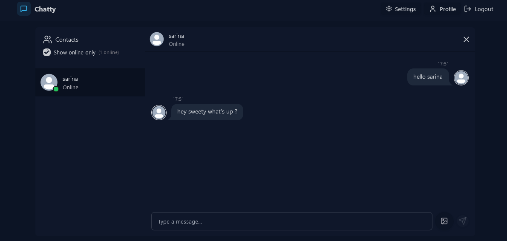

# Real-Time Chat Application



Welcome to the **Real-Time Chat Application**! This is a feature-rich chat application built with the MERN stack, designed for seamless real-time communication. The app is deployed on a VPS with Nginx and PM2, ensuring high availability and performance.


## 🛠️ Features

- **Real-Time Messaging:** Instant communication using WebSocket.
- **User Authentication:** Secure login and registration.
- **Image Support:** Upload and display images using Cloudinary.
- **Responsive UI:** Optimized for both desktop and mobile devices.
- **State Management:** Zustand for efficient state handling.
- **Data Fetching:** Axios for API integration.
- **Best Practices:** Followed modern coding standards and security measures.

---

## 🏗️ Tech Stack

### Frontend
- **React.js**: For building the user interface.
- **Zustand**: Lightweight state management.
- **Axios**: To handle API requests.

### Backend
- **Node.js & Express.js**: For building REST APIs.
- **MongoDB**: NoSQL database for storing user data and messages.
- **Cloudinary**: For storing and retrieving uploaded images.
- **Socket.IO**: Real-time bidirectional communication.

### Deployment
- **VPS**: Hosted both frontend and backend on a Virtual Private Server.
- **Nginx**: Reverse proxy for better performance and security.
- **PM2**: Process manager to keep the application running smoothly.

---

## 🚀 Installation and Setup

1. Clone the repository:

   ```bash
   git clone https://github.com/cykoravish/online-chats-mern.git
   cd online-chats-mern

2. Install backend dependencies
   cd backend
   npm install

3. Install frontend dependencies
   cd ../frontend
   npm install

4. Create .env files as described in example .env file for both frontend and backed. 

   ```

## 🤝 Contributing

   We welcome contributions to improve this application! To contribute:
   Submit a pull request to this repository.
   We’ll review your PR and merge it if everything looks good! 🎉

## 📄 License

    This project is licensed under the MIT License. Feel free to use, modify, and distribute this project.

## 🧑‍💻 Contact

   If you have any questions or suggestions, feel free to reach out to the project maintainer.

   - Email: ravishbisht86@gmail.com
   - GitHub: https://github.com/cykoravish
   - Website: https://onlinechats.shop
   - Happy Coding! 🚀

